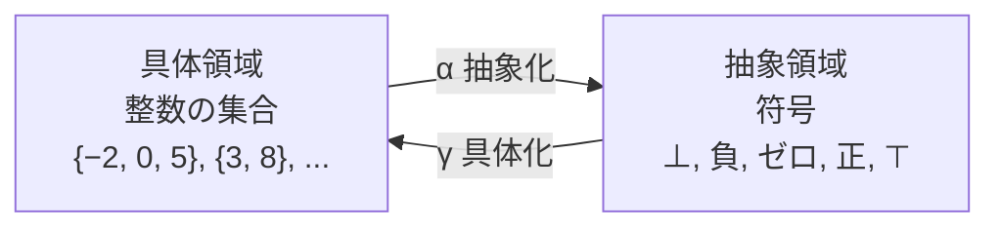
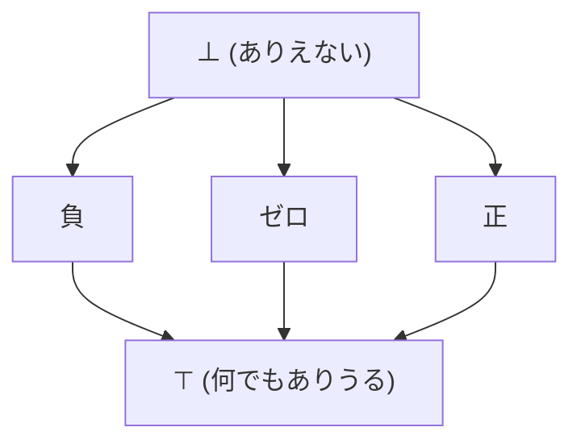

# 抽象解釈

ここまで、型推論とデータフロー解析という一見別物の技術を見てきました。どちらも「制約を集め、安全側に近似し、不動点を求める」という共通の匂いがありました。この共通項を正面から理論にしたのが、Patrick Cousot と Radhia Cousot が1977年に提唱した **抽象解釈（abstract interpretation）** です[Cousot and Cousot, 1977](#cite:cousot1977)。静的解析全体を貫く「共通言語」であり、第4部の入口にふさわしい主題です。

## 動機：全部の実行を、まとめて、近似で実行する

プログラムの性質を確実に知りたいなら、すべての入力で実際に実行してみればよい ── しかし入力は無限にあり、それは不可能です。一方、型のように構文だけ見る解析は速いけれど、値の具体的な範囲のような細かい性質は捉えにくい。

抽象解釈の発想は、その中間を行きます。**「具体的な値そのもの」ではなく「値の抽象的な性質」を使って、プログラムを一度だけ実行する**のです。たとえば整数の正確な値の代わりに「正・負・ゼロ」という符号だけを追って実行すれば、`(正) * (正) = (正)` のように、性質のレベルで計算が進みます。すべての具体的な実行を、抽象的な実行**一回**で覆ってしまう ── これが核心です。

> [!NOTE]
> 鍵となる割り切りは「**健全な近似を許す**」ことです。前章で見たとおり、プログラムの正確な性質は一般に判定不能です。だから抽象解釈は正確さをあきらめ、その代わり「**安全側に外す**」ことを保証します。「正かもしれない」を「分からない（どんな符号でもありうる）」と粗く言うのは許すが、「実は負なのに正と言い切る」ような**間違った断言は決してしない**。この一方向の保証が、解析を信頼できるものにします。

## 具体と抽象をつなぐ

抽象解釈の登場人物は2つの世界です。

- **具体領域（concrete domain）**：プログラムが実際に扱う値の世界。たとえば「変数 `x` がとりうる整数の集合」。`{1, 2, 3}` や `{-5, 0, 7}` のような集合です。
- **抽象領域（abstract domain）**：解析が扱う、性質を表す近似された世界。たとえば符号領域 `{⊥, 負, ゼロ, 正, ⊤}`。`⊥`（ボトム）は「ありえない」、`⊤`（トップ）は「何でもありうる」を表します。

2つの世界は、向きの違う2つの関数で結ばれます。

- **抽象化関数 α（abstraction）**：具体集合を、それを覆う最も精密な抽象値に写す。たとえば `α({2, 5, 9}) = 正`、`α({-1, 0, 3}) = ⊤`（符号がそろっていないので「何でも」）。
- **具体化関数 γ（concretization）**：抽象値を、それが表す具体集合に戻す。たとえば `γ(正) = {1, 2, 3, ...}`（すべての正整数）。

この α と γ が、ある望ましい関係（**ガロア接続／Galois connection**）を満たすように設計するのが、抽象解釈の作法です。ガロア接続は直感的には「α と γ がきれいに対応し、抽象化が**安全な近似**になっている」ことを保証する条件です。これがあると、「抽象の世界で計算した結果は、具体の世界の真の結果を必ず覆っている（健全である）」ことが**数学的に証明できます**。Cousot 夫妻の original paper [Cousot and Cousot, 1977](#cite:cousot1977)の最大の貢献は、この健全性を一般的な枠組みとして確立したことです。



## 例：符号解析を組み立てる

具体例で感触をつかみましょう。「各変数の符号を追う」符号解析を考えます。抽象領域は `{⊥, 負, ゼロ, 正, ⊤}` です。これらは「精密さ」で順序が付き、`⊥` が一番下（精密）、`⊤` が一番上（粗い）の**格子**をなします。



抽象領域の上で、演算の**抽象版**を定義します。掛け算なら、符号だけで結果の符号が決まる場面が多いので、表で与えられます。

```ruby
# 符号の掛け算（抽象演算）
SIGN_MUL = {
  [:pos, :pos] => :pos,  [:pos, :neg] => :neg,
  [:neg, :neg] => :pos,  [:neg, :pos] => :neg,
  [:zero, :pos] => :zero, [:zero, :neg] => :zero,
  # どちらかが ⊤ なら結果も ⊤（分からない）
}
def mul_sign(a, b)
  return :top if a == :top || b == :top
  return :zero if a == :zero || b == :zero
  SIGN_MUL[[a, b]] || :top
end
```

足し算は厄介です。`(正) + (負)` は正にも負にもゼロにもなりうるので、結果は `⊤`（分からない）になります。これが**近似による精度の損失**です。符号領域は掛け算には強いが足し算には弱い、というわけです。

合流点では、複数の経路の抽象値を **束ねる（join）** ます。あるブロックに「正」で来る経路と「ゼロ」で来る経路があれば、束ねた結果は両方を覆う最小の値、ここでは `⊤`（正でもゼロでもありうる）になります。そして前章と同じく、CFG の上で**不動点反復**を回せば、各地点での各変数の符号が求まります。

```text
n = 5            # n: 正
x = 1            # x: 正
while ...        # ループ
  x = x * n      # 正 * 正 = 正 → x は正のまま
end
# ループを抜けても x: 正 が保たれる
assert x > 0     # ← 符号解析だけで「x は常に正」が証明できる
```

符号解析という**たった5値の抽象**だけで、「このループを抜けたあと `x` は必ず正」という非自明な事実を、実行せずに証明できました。これが抽象解釈の威力です。前章のデータフロー解析（生存変数や定数伝播）も、実はそれぞれ専用の抽象領域を選んだ抽象解釈の一種だと見なせます。Kildall の格子に基づく枠組み[Kildall, 1973](#cite:kildall1973)と抽象解釈が地続きなのは、こういうわけです。

## ウィドニング：無限の格子で止めるための工夫

符号領域は値が5つしかないので、不動点反復は必ずすぐ止まります。しかし、もっと精密な抽象領域を使うと話が変わります。たとえば **区間領域（interval domain）** ── 各変数を `[下限, 上限]` の区間で近似する ── は、はるかに精密ですが、区間の格子は**無限の高さ**を持ちます。

```text
i = 0
while i < 1000000
  i = i + 1
end
```

このループを区間解析で素直に回すと、`i` の区間が `[0,0] → [0,1] → [0,2] → ...` と1ずつ増え続け、100万回回るまで不動点に達しません。これでは実用になりません。

そこで導入されるのが **ウィドニング（widening, 拡大演算）** です。「区間が増え続けている」と気づいたら、上限を一気に `+∞` へ飛ばすなど、**わざと粗く近似して収束を強制する**操作です。`[0,1]` の次が `[0,2]` と増えたら、「どこまで増えるか分からない」と判断して `[0, +∞]` にジャンプさせます。これで反復はすぐ止まります。失った精度は、必要なら **ナローイング（narrowing, 縮小演算）** で後から取り戻します。

> [!IMPORTANT]
> ウィドニングは抽象解釈を**実用化**する決定的な道具です。無限の高さを持つ精密な抽象領域でも、ウィドニングがあれば有限時間で必ず停止します。代償は精度の低下ですが、「いつまでも止まらない」より「少し粗いがすぐ終わる」ほうが実用上はるかに価値があります。区間解析を使った商用ツール（航空宇宙ソフトの検証に使われる Astrée など）は、洗練されたウィドニング戦略の上に成り立っています。

## なぜ抽象解釈が「共通言語」なのか

抽象解釈の真価は、個別の解析を作る道具であること以上に、**解析を設計し、その正しさを保証するための一般的な型紙**を与えることにあります。新しい解析を作りたいとき、

1. 何を追いたいか決める → **抽象領域**を設計する。
2. 各操作が抽象値をどう変えるか決める → **抽象演算**を定義する。
3. ガロア接続を確認する → **健全性が自動的に保証される**。
4. 領域が無限に高ければ → **ウィドニング**で収束させる。

という手順を踏めばよい。健全性を毎回ゼロから証明し直す必要がありません。型推論、データフロー解析、形状解析、契約検証 ── これらを「抽象領域の選び方の違い」として統一的に語れるのが、抽象解釈が静的解析の共通言語と呼ばれるゆえんです。

## まとめ

抽象解釈は、プログラムを「値の抽象的な性質」のレベルで一度だけ実行し、すべての具体的実行を健全に覆う、静的解析の統一理論です。

- **動機**：判定不能な正確な性質を、健全な近似で実用的に求める。個別の解析を統一的に設計・正当化する。
- **結果**：各地点での抽象値（符号・区間など）と、それに裏打ちされた健全な性質の証明。
- **手法**：具体／抽象の領域をガロア接続で結び、抽象演算を定義し、不動点反復で解く。無限格子はウィドニングで収束させる。

抽象解釈という地図を手に入れたところで、最後の章では、この理論の上に咲いた研究の最前線 ── 篩型、エフェクト、所有権、分離論理、SMT ── を一望します。
