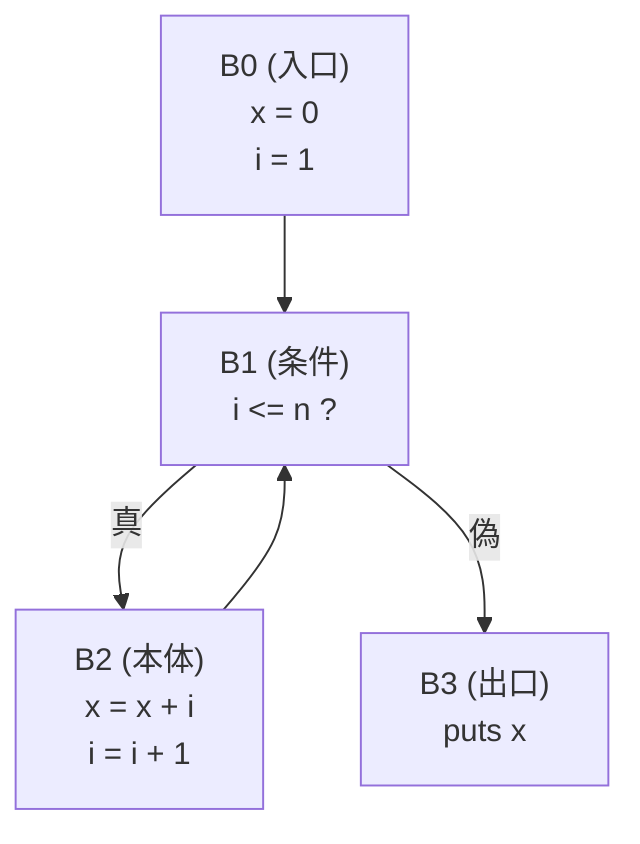

# 制御フロー解析

第2部までの解析は、プログラムの**書かれ方**（名前の構造、式の型）を調べてきました。第3部では視点を変え、プログラムを実行したときに**実行の流れ（制御）がどこをどう通るか**を、実行せずに調べます。その出発点が **制御フロー解析（control flow analysis）** であり、主役は **制御フローグラフ（control flow graph, CFG）** です。

## 動機：実行の道筋を地図にする

「このコードに到達することはあるのか」「このループから抜ける道はあるのか」「すべての分岐で戻り値は設定されるか」── こうした問いは、AST を眺めているだけでは答えにくいものです。AST は構文の入れ子を表しますが、`if` や `while`、`break`、`return` が作る**実行順序のつながり**は、木の形には直接現れていないからです。

そこで、プログラムを「実行されうる経路の地図」として描き直します。これが CFG です。CFG さえあれば、

- **検証**：到達不能コード（dead code）、戻り値の付け忘れ、初期化前の変数使用などを見つけられる。
- **最適化の土台**：次章のデータフロー解析は、ほぼすべて CFG の上で行われる。

制御フロー解析は、それ自体が成果物（警告）を生むと同時に、後続のあらゆるフロー解析の**舞台**を用意する、二重の役割を持ちます。

## 制御フローグラフ

CFG は、ノードが **基本ブロック（basic block）**、辺が「実行が移りうる方向」を表す有向グラフです。基本ブロックとは、「途中で枝分かれも飛び込みもない、上から下へ一直線に実行される文の並び」のことです。ブロックの**先頭にだけ**入ってこられ、**末尾からだけ**出ていく、という性質を持ちます。

たとえば次のコードを考えます。

```ruby
x = 0
i = 1
while i <= n
  x = x + i
  i = i + 1
end
puts x
```

これを CFG にすると、次のようになります。



ループが、グラフ上では `B1 → B2 → B1` という**閉路（サイクル）** として素直に表れている点に注目してください。AST では `while` という1ノードに隠れていた「繰り返し」が、CFG では辺の循環として目に見える形になります。`if` なら分岐して合流する菱形、`break` なら閉路の外への辺、というように、制御構造がグラフの形に翻訳されます。

> [!NOTE]
> 基本ブロックに区切る基準は2つだけです。(1) **リーダー（leader, ブロックの先頭）** になるのは、プログラムの最初の文、分岐の飛び先になる文、分岐文の直後の文。(2) 各リーダーから次のリーダーの直前までが1つの基本ブロック。この単純な規則で、命令列を機械的にブロックへ分割できます[](#cite:aho2006)。

## AST から CFG を組み立てる

CFG は AST から機械的に作れます。各構文を「入口ブロックと出口ブロックを持つ部品」とみなし、部品同士を辺でつないでいく、という発想です。ビジターで AST をたどりながら、いまの「末尾のブロック」を持ち回り、文を追加したり新しいブロックへ枝を張ったりします。

```ruby
class CFGBuilder < Visitor
  def initialize
    @cfg     = CFG.new
    @current = @cfg.new_block   # いま命令を積んでいるブロック
  end

  # 単純な文（代入など）：いまのブロックに足すだけ
  def visit_assign(node)
    @current.add(node)
  end

  # if 文：分岐して、両腕の出口を合流ブロックへつなぐ
  def visit_if(node)
    cond_block = @current
    cond_block.add(node.cond)

    then_block = @cfg.new_block
    cond_block.connect(then_block, label: :true)
    @current = then_block
    visit(node.then_body)
    then_end = @current

    else_block = @cfg.new_block
    cond_block.connect(else_block, label: :false)
    @current = else_block
    visit(node.else_body)
    else_end = @current

    join = @cfg.new_block          # 合流点
    then_end.connect(join)
    else_end.connect(join)
    @current = join                # 以降の文は合流ブロックへ
  end

  # while 文：条件ブロックへ戻る辺（閉路）を張る
  def visit_while(node)
    cond_block = @cfg.new_block
    @current.connect(cond_block)
    cond_block.add(node.cond)

    body_block = @cfg.new_block
    cond_block.connect(body_block, label: :true)
    @current = body_block
    visit(node.body)
    @current.connect(cond_block)   # ← ループバックの辺

    exit_block = @cfg.new_block
    cond_block.connect(exit_block, label: :false)
    @current = exit_block
  end
end
```

ポイントは、**構文の入れ子（AST）を、ブロック間の辺の構造（CFG）へ翻訳している**ことです。`if` は分岐＋合流、`while` は条件への戻り辺、というように、それぞれの制御構造がグラフ操作に対応します。これが制御フロー解析の中心的な**手法**です。

> [!NOTE]
> `return`・`break`・`raise` のような文は、いまのブロックから「直後の文」へは流れません。`return` なら関数出口へ、`break` なら対応するループの外側へ、`raise` なら例外ハンドラへ向かう辺を張り、直後のブロックへの辺は張らないことになります。そのため実用的な CFG 構築では、「いまのブロックに通常の後続はあるか」を状態として持ち回ることが多くなります。

## CFG から分かること

CFG が手に入ると、グラフのアルゴリズムでさまざまな性質が調べられます。

**到達可能性（reachability）。** 入口ブロックから辺をたどって到達できないブロックは、**決して実行されないコード**です。グラフ探索（深さ優先探索など）で入口から印を付けていき、印の付かなかったブロックを「到達不能コード」として警告できます。`return` の後ろに書かれた文のように、制御構造だけから到達不能と分かるものはこれで見つかります。一方、「条件が常に偽なのでこの分岐には決して入らない」といったケースは、CFG の到達可能性だけでは分からず、定数伝播や抽象解釈のような**条件式の値を近似する解析**（後の章で扱います）と組み合わせて初めて検出できます。

```ruby
def reachable_blocks(cfg)
  seen  = {}
  stack = [cfg.entry]
  until stack.empty?
    b = stack.pop
    next if seen[b]
    seen[b] = true
    b.successors.each { |s| stack.push(s) }   # 辺をたどる
  end
  seen.keys
end
# cfg.blocks - reachable_blocks(cfg) が「到達不能なブロック」
```

**支配関係（dominance）。** ブロック `B` を通らずには入口から `B'` に決して到達できないとき、「`B` は `B'` を**支配する（dominate）**」と言います。たとえば、構造化された `while` から作られるループでは、条件ブロック（**ループヘッダ**）が本体のすべてのブロックを支配します。任意の CFG では `goto` などにより複数の入口を持つループもありえますが、逆にこの「ヘッダが本体を支配する」性質を使って **自然ループ（natural loop）** を定義し、検出します。支配関係は、ループ検出や、次章で触れる SSA 形式の構築[](#cite:cytron1991)に欠かせない、CFG 解析の中核概念です。

**確定代入（definite assignment）。** 「変数が使われるすべての経路で、その手前に必ず代入があるか」を CFG 上で確かめると、初期化前の変数使用を検出できます。これは Java や C# が実際に行っているコンパイル時チェックで、CFG とこのあと学ぶデータフロー解析を組み合わせて実現されます。

> [!WARNING]
> 例外、`goto`、複数の `return`、後始末処理（`ensure` / `finally`）などが入ると、CFG の辺は一気に複雑になります。「例外がここで投げられたら、どのブロックへ飛ぶか」を辺として表す必要があるからです。実用処理系の CFG 構築コードの多くは、こうした非局所的な制御の扱いに紙幅の大半を費やします。

## まとめ

制御フロー解析は、プログラムの実行経路を制御フローグラフ（CFG）として表し、グラフとして調べる解析です。

- **動機**：実行の道筋を地図にし、到達不能コードや初期化忘れを検出する（検証）。後続のフロー解析の舞台を用意する。
- **結果**：基本ブロックを節点とする CFG。そこから到達可能性・支配関係・自然ループなどの情報。
- **手法**：AST の各制御構造（if・while など）を、ブロックと辺の操作へ機械的に翻訳して CFG を構築する。

CFG という地図ができたら、次はその上で「どの値がどこまで流れるか」を計算します。最適化と静的解析の心臓部、データフロー解析へ進みましょう。
