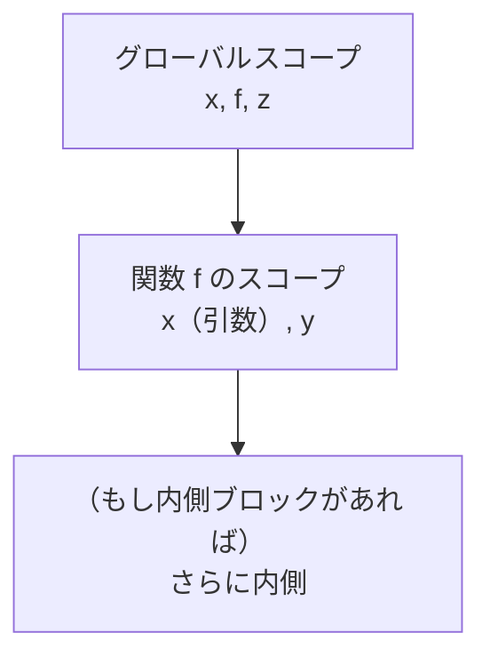

# 名前解決とスコープ解析

意味解析の最初の一歩は、プログラム中の**名前が何を指しているか**を確定させることです。これを **名前解決（name resolution）**、その舞台となる「名前が有効な範囲」を調べることを **スコープ解析（scope analysis）** と呼びます。地味に見えますが、これがなければ型検査もデータフロー解析も始まりません。すべての意味解析の土台です。

## なぜ名前を解決する必要があるのか

次の Ruby 風コードを見てください。

```ruby
x = 10
def f(x)
  y = x + 1
  y * 2
end
z = f(5) + x
```

ここには `x` が3回出てきますが、同じ `x` ではありません。1行目の `x` と最後の行の `x` は同じトップレベルの変数ですが、`f` の引数 `x` と本体の `x` はそれとは**別物**です。人間はインデントとスコープの知識から自然に区別できますが、AST にはこの区別が**書かれていません**。AST 上ではどれもただの「`x` という名前のノード」にすぎないのです。

名前解決の仕事は、各「名前の出現（use, 使用）」を、それを定義している「宣言（declaration, 定義）」に**結びつける**ことです。結びつけられて初めて、

- **検証**：「未定義の変数を使っていないか」「定義済みの名前を二重に定義していないか」を確認できる。
- **情報付与**：「この変数の型は？」と問うとき、どの宣言の型を見ればよいかが分かる。後続の型検査やコード生成が、変数の格納場所を決められる。

といったことが可能になります。逆に言えば、名前解決を間違えると後続の解析がすべて狂います。

> [!NOTE]
> 名前解決は「使用 → 宣言」の対応付けですが、もう一方向、「宣言 → そのすべての使用」も同時に分かるようにしておくと便利です。エディタの「定義へ移動」は前者、「すべての参照を検索」は後者を使っています。リネームのような自動リファクタリングも、正確な名前解決があって初めて成り立ちます。

## スコープという考え方

名前解決の鍵は **スコープ（scope, 有効範囲）** です。スコープとは、ある宣言が**見える**（参照できる）プログラム上の領域のことです。多くの言語は **静的スコープ（static scope / lexical scope, 字句スコープ）** を採用しています。これは「名前がどの宣言を指すかは、プログラムの**書かれ方**（ソース上のネストの構造）だけで決まり、実行の流れには依存しない」という規則です。

> [!NOTE]
> 対義語は **動的スコープ（dynamic scope）** で、「実行時の呼び出しの連なり」で名前の指す先が決まります。初期の Lisp などが採用していましたが、プログラムを追いにくいため現代の主要言語はほぼ静的スコープです。本書でも以後、特に断らなければ静的スコープを前提とします。

静的スコープでは、スコープは**入れ子（ネスト）** になります。関数の中にブロックがあり、その中にまたブロックがある、というように。名前を解決するときは、

1. いま**いちばん内側**のスコープでその名前を探す。
2. 見つからなければ**一つ外側**のスコープを探す。
3. これを繰り返し、いちばん外側（グローバル）まで探す。
4. どこにもなければ「未定義」エラー。

という規則でたどります。これを **スコープチェーン（scope chain）をたどる** と言います。内側で見つかった宣言が外側の同名宣言を**隠す**ことを **シャドーイング（shadowing, 遮蔽）** と呼びます。先ほどの例で `f` の引数 `x` がトップレベルの `x` を隠していたのが、まさにシャドーイングです。



名前 `x` を関数 `f` の中で探すと、まず `f` のスコープで引数 `x` が見つかるので、そこで解決が止まります。グローバルの `x` までは届きません。

## シンボルテーブル：名前解決の道具箱

スコープと宣言の情報を蓄える基本的なデータ構造が **シンボルテーブル（symbol table, 記号表）** です。名前から、その名前についての情報（**シンボル情報／symbol information**：種類、型、宣言位置など）への対応表です。スコープが入れ子なので、シンボルテーブルも入れ子のスタックとして管理するのが定石です。

```ruby
# 入れ子スコープを表すシンボルテーブル
class Scope
  attr_reader :parent

  def initialize(parent = nil)
    @parent = parent      # 一つ外側のスコープ（なければ nil）
    @table  = {}          # 名前 => シンボル情報
  end

  # この階層に名前を宣言する
  def declare(name, info)
    if @table.key?(name)
      raise "二重定義: #{name}"   # 同じスコープでの再宣言は誤り
    end
    @table[name] = info
  end

  # 名前を解決する：内側から外側へ探す（スコープチェーン）
  def resolve(name)
    @table[name] || (@parent && @parent.resolve(name))
  end
end
```

`resolve` が、先ほど述べた「内側から外側へ順に探す」規則をそのまま再帰で表現しています。見つからなければ最終的に `nil` を返し、それが「未定義」を意味します。

名前解決は、この `Scope` を持ち歩きながら AST をたどることで実現します。前章のビジターパターンを使い、スコープを作る構文（関数定義やブロック）に入るときに新しい `Scope` をスタックに積み、出るときに降ろします。

```ruby
class Resolver < Visitor
  def initialize
    @scope = Scope.new        # グローバルスコープ
  end

  # 関数定義：新しいスコープを作り、引数を宣言してから本体を見る
  def visit_def(node)
    @scope.declare(node.name, kind: :function, arity: node.params.size)
    enter_scope do
      node.params.each { |p| @scope.declare(p.name, kind: :param) }
      visit_children(node.body)
    end
  end

  # 変数参照：いま見えているスコープで解決を試みる
  def visit_var(node)
    info = @scope.resolve(node.name)
    raise "未定義の変数: #{node.name}" if info.nil?
    node.resolved = info     # AST ノードに解決結果を書き込む（装飾）
  end

  private

  def enter_scope
    @scope = Scope.new(@scope)   # 内側スコープを積む
    yield
    @scope = @scope.parent       # 抜けるときに降ろす
  end
end
```

ここで起きていることを整理すると、

- スコープは前章で言う **継承属性** です。外側から内側へ「いま使える名前の集合」を受け渡していきます（`enter_scope` で親を引き継ぐ）。
- 解決結果 `node.resolved` を AST に書き込むことで、木が**装飾**されます。後続の型検査はこの `resolved` を見て、変数の宣言情報にたどり着けます。

これが名前解析の**得られる結果**です。すべての名前の使用が、対応する宣言に結びついた装飾済み AST。教科書的な実装の詳細は[Appel, 1998](#cite:appel1998)や[Cooper and Torczon, 2011](#cite:cooper2011)が詳しく扱っています。

## 言語ごとの厄介な規則

名前解決は「内側から外側へ探すだけ」と思いきや、実際の言語には例外的な規則がたくさんあり、そこが腕の見せどころです。代表的なものを挙げます。

**前方参照（forward reference）。** 関数やクラスを、定義より**前**で使えてよいか。多くの言語はトップレベルの関数やクラスについて前方参照を許します。

```ruby
puts greet      # greet はまだ下にしか定義されていない
def greet = "hi"
```

これを許すには、本体を解析する**前に**、まずそのスコープのすべての宣言を一周だけ先に集める **二段階（two-pass）** の名前解決が必要です。1回目で宣言を全部 `declare` し、2回目で本体の使用を `resolve` する、という構成です。ローカル変数については、通常これを許さない（使用は宣言より後でなければならない）言語が多く、同じ言語の中でも種類ごとに規則が違う点に注意が必要です。

**名前空間（namespace）。** 同じ名前でも「種類」が違えば共存できることがあります。たとえば多くの言語で、型の名前と変数の名前は別々の名前空間に属し、`Integer` という型と `Integer` という変数が衝突しません。Ruby ではローカル変数とメソッドが（呼び出し方によって）別扱いです。シンボルテーブルを「名前」だけでなく「（名前, 種類）」で引くようにして対応します。

**修飾名（qualified name）。** `Math.sqrt` や `std::vector` のように、ドットやコロンで区切られた名前は、まず左側（`Math`、`std`）を解決し、その結果が指すスコープ（モジュールや名前空間）の**中で**右側を解決します。スコープチェーンとは別に「そのオブジェクトのメンバを引く」処理が必要になります。

> [!WARNING]
> 名前解決の規則は言語仕様の中でも特に細かく、しかも直感に反する隅があります。たとえば「ループ変数のスコープはループの中だけか、外にも漏れるか」は言語によって異なります（JavaScript の `var` と `let` の違いはまさにこれ）。新しい言語の処理系を読むときは、まず名前解決の規則を仕様で確認するのがおすすめです。

## まとめ

名前解決は、AST 上のすべての名前の使用を、その宣言に結びつける解析です。

- **動機**：未定義・二重定義の検出（検証）と、後続解析が宣言情報にたどり着くための足場づくり（情報付与）。
- **結果**：各使用が宣言に結びついた、装飾済みの AST。
- **手法**：入れ子のスコープとシンボルテーブルを使い、内側から外側へ名前を探す（スコープチェーン）。前方参照のためには二段階解析を、名前空間や修飾名のためには引き方の工夫をする。

スコープという「上から下へ流れる情報」と、解決結果という「木に書き込まれる注釈」── この2つが揃ったら、次はいよいよ、書き込まれた宣言に**型**を結びつけ、その整合性を確かめる段階です。第2部「型に関する解析」へ進みましょう。
